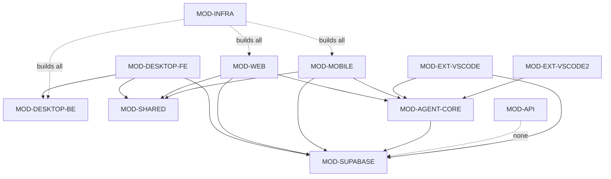

# VoiceCode Dependency Graph

> Version: 2.0.0 | Updated: 2026-02-27 | DICE v3.6

## Module Dependencies (Mermaid)



## Dependency List (Plain Text)

| Module | Depends On | Depended On By |
|--------|-----------|----------------|
| MOD-DESKTOP-BE | — (leaf backend) | MOD-DESKTOP-FE |
| MOD-DESKTOP-FE | MOD-DESKTOP-BE, MOD-SUPABASE, MOD-SHARED | — |
| MOD-WEB | MOD-SUPABASE, MOD-AGENT-CORE, MOD-SHARED | — |
| MOD-MOBILE | MOD-SUPABASE, MOD-AGENT-CORE, MOD-SHARED | — |
| MOD-AGENT-CORE | MOD-SUPABASE | MOD-WEB, MOD-MOBILE, MOD-EXT-* |
| MOD-API | — (standalone) | — |
| MOD-SUPABASE | — (infrastructure) | MOD-DESKTOP-FE, MOD-WEB, MOD-MOBILE, MOD-AGENT-CORE, MOD-EXT-VSCODE |
| MOD-EXT-VSCODE | MOD-SUPABASE, MOD-AGENT-CORE | — |
| MOD-EXT-VSCODE2 | MOD-AGENT-CORE | — |
| MOD-SHARED | — (library) | MOD-DESKTOP-FE, MOD-WEB, MOD-MOBILE |
| MOD-INFRA | All (CI builds all) | — |
| MOD-DOCS | — | — |

## Parallel Lanes

Based on dependency analysis, 5 independent lanes can execute concurrently after contract freeze:

| Lane | Modules | Prerequisite |
|------|---------|-------------|
| A: Desktop | MOD-DESKTOP-BE, MOD-DESKTOP-FE | GATE-CONTRACT-FREEZE |
| B: Web | MOD-WEB | GATE-CONTRACT-FREEZE |
| C: Mobile | MOD-MOBILE | GATE-CONTRACT-FREEZE |
| D: Backend | MOD-AGENT-CORE, MOD-API, MOD-SUPABASE | None (freezes contracts for others) |
| E: Extensions | MOD-EXT-VSCODE, MOD-EXT-VSCODE2 | Agent Core API stable |

## Critical Path

```
MOD-SUPABASE (schema) → MOD-AGENT-CORE (API) → GATE-CONTRACT-FREEZE
  → [parallel] MOD-WEB, MOD-MOBILE, MOD-DESKTOP-FE
  → MOD-INFRA (CI integration)
```
